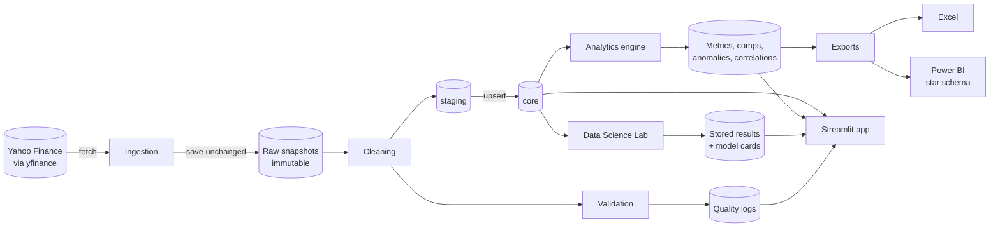
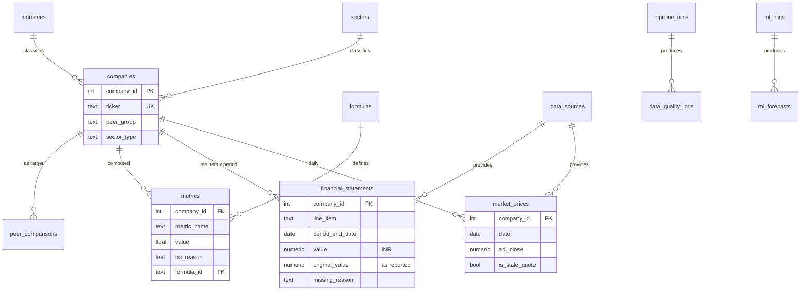

# FinSight

**Financial Markets & Comparable Companies Analytics Platform (Indian Equities)**

An end-to-end data science project: public market and financial-statement data for 25 NSE-listed
companies is ingested, validated, stored in PostgreSQL, turned into auditable analytics, and used
for leakage-free volatility forecasting, peer clustering and statistical testing. Results are
served by a Streamlit app, Excel workbooks and a Power BI-ready star schema.

> FinSight is an analytics tool, not investment advice. It never predicts prices or recommends
> securities.

## Contents

- [Problem and solution](#problem-and-solution)
- [Features](#features)
- [Architecture](#architecture)
- [Tech stack](#tech-stack)
- [Setup](#setup)
- [Commands](#commands)
- [Data sources](#data-sources)
- [Methodology in brief](#methodology-in-brief)
- [Results in brief](#results-in-brief)
- [Screenshots](#screenshots)
- [Project structure](#project-structure)
- [Limitations](#limitations)
- [Documentation](#documentation)

## Problem and solution

**Problem.** Free financial data is messy in ways that silently corrupt analysis: statement
history is short and has gaps, one company is reported in another currency, share counts are
restated inconsistently after bonus issues, placeholder rows appear on market holidays, and many
standard ratios are meaningless for banks. A comparable-company table or a model built on top of
that, without checks, produces confident wrong numbers.

**Solution.** A pipeline in which every number is traceable and every modelling claim is tested:

```text
Public source → Ingestion → Raw snapshot (immutable) → Cleaning → Validation
→ PostgreSQL (staging → core) → Ratio & valuation engine → Comps / Market / Risk analytics
→ Data Science Lab → Streamlit app + Excel exports + Power BI-ready star schema
```

## Features

| Area | What it does |
|---|---|
| Configurable universe | 25 companies in 5 sectors, the Nifty 50 benchmark and the risk-free rate are defined in `config/universe.yaml` and nowhere else |
| Ingestion | Retries with backoff; every response saved unchanged as a read-only snapshot with metadata; one failed ticker never stops a run |
| Cleaning | Idempotent; canonical line items via a field map; missing values are NULL with one of three reasons, never 0; USD statements translated to INR with the rate, rate type and reported value kept |
| Validation | 24 checks logged per run (market data, financials, completeness, consistency, freshness), with a computed pass rate |
| Database | PostgreSQL with `staging → core → mart` layers, natural-key upserts, and constraints that enforce "value XOR reason" |
| Ratio engine | 42 registered metrics as pure functions, each with a formula id, unit and the sector types it applies to; a bank is never shown an EBITDA margin |
| Valuation | Market cap, EV, P/E, P/B, EV/EBITDA, EV/Revenue, current (TTM where available) and historical, reconciled against the source's own multiples |
| Comparable companies | Peer statistics that exclude the target and N/A peers, percentile or rank positioning, rule-generated descriptive sentences |
| Returns and risk | Trailing returns, volatility, downside deviation, Sharpe, maximum drawdown with peak and trough dates, correlation |
| Anomaly detection | Robust rules (IQR fences, modified z-score), sector-adjusted for fundamentals, leakage-free rolling windows for market data |
| Data Science Lab | Volatility forecasting with walk-forward evaluation against naive baselines; peer clustering validated against sector labels; statistical tests with effect sizes, confidence intervals and multiple-comparison correction; regime detection; Isolation Forest comparison |
| App | Seven Streamlit pages that read only from PostgreSQL |
| Exports | Three Excel workbooks with live formulas; a star schema for Power BI as CSV files and database views, with documented DAX measures |
| Tests | 202 tests, 97% coverage, no network calls; expected values are hand-calculated |

## Architecture



Core entities:



More diagrams (module map, star schema) and the design decisions are in
[`docs/architecture.md`](docs/architecture.md).

## Tech stack

| Purpose | Tools |
|---|---|
| Core | Python 3.11+ (built and verified on 3.13), pandas, NumPy, SQLAlchemy 2, psycopg 3, Pydantic |
| Database | PostgreSQL 16 (Docker) |
| Data | yfinance |
| Data science | scikit-learn, SciPy, statsmodels, arch |
| App | Streamlit, Plotly |
| Exports | openpyxl, CSV |
| Quality | pytest, pytest-cov, ruff, Python logging |

Versions are pinned in [`requirements.txt`](requirements.txt).

## Setup

### macOS

Requirements: Python 3.11 or newer, Docker Desktop, git.

```bash
git clone https://github.com/Yash-Thakkar27/FinSight.git
cd FinSight

python3 -m venv .venv
source .venv/bin/activate
pip install -r requirements.txt

cp .env.example .env            # then edit .env and set POSTGRES_PASSWORD

open -a Docker                  # start Docker Desktop if it is not running
docker compose up -d            # PostgreSQL 16 on localhost:5433
```

Then initialize, load data, run the models and start the app:

```bash
python scripts/init_db.py       # schemas, tables, views, reference data
python scripts/update_data.py   # fetch, clean, validate, load, metrics, exports (about 3 minutes)
python scripts/run_ml.py        # Data Science Lab and model cards (about a minute)
pytest                          # 202 tests
streamlit run app/Home.py       # http://localhost:8501
```

Notes:

- The database listens on host port **5433**, so it does not clash with a PostgreSQL already on
  5432. Change `POSTGRES_PORT` in `.env` if 5433 is taken.
- To run a second copy of the project on the same machine, give it its own
  `POSTGRES_PORT` and `POSTGRES_CONTAINER` in `.env`.
- `update_data.py` needs internet access. Everything after it works offline.
- To keep the app off your local network, start it with
  `streamlit run app/Home.py --server.address localhost`.

**PostgreSQL through Homebrew instead of Docker** (written but not verified on the development
machine):

```bash
brew install postgresql@16
brew services start postgresql@16
createuser -s finsight
createdb -O finsight finsight
psql -d finsight -c "ALTER USER finsight WITH PASSWORD 'your_password';"
```

Then set `POSTGRES_PORT=5432` and the same password in `.env`.

### Windows

Not verified on Windows; these are the equivalent commands. Requirements: Python 3.11+, Docker
Desktop, git. In PowerShell:

```powershell
git clone https://github.com/Yash-Thakkar27/FinSight.git
cd FinSight
py -m venv .venv
.venv\Scripts\Activate.ps1
pip install -r requirements.txt
copy .env.example .env          # then edit .env and set POSTGRES_PASSWORD
docker compose up -d
python scripts\init_db.py
python scripts\update_data.py
python scripts\run_ml.py
pytest
streamlit run app\Home.py
```

## Commands

| Command | What it does |
|---|---|
| `python scripts/init_db.py` | Create schemas, tables, views and indexes; seed reference data. Safe to rerun. |
| `python scripts/init_db.py --reset` | Drop everything first. **Deletes all data in the database.** |
| `python scripts/update_data.py` | Full refresh: fetch → raw → clean → validate → load → metrics → exports. Prints the data-quality report. |
| `python scripts/update_data.py --tickers TCS.NS INFY.NS` | Fetch only these tickers; the rest of the pipeline still covers the whole universe. |
| `python scripts/update_data.py --skip-fetch` | Rebuild everything from the raw snapshots on disk. No network. |
| `python scripts/run_ml.py` | Run the Data Science Lab, store results, regenerate the model cards. |
| `python scripts/run_ml.py --tasks volatility clustering` | Run selected tasks. |
| `streamlit run app/Home.py` | Start the app. |
| `pytest` | Run the tests. Database tests use a separate `finsight_test` database and skip if PostgreSQL is unreachable. |
| `pytest --cov=src --cov=app` | With coverage. |
| `ruff check .` | Lint. |
| `python scripts/build_data_dictionary.py` | Regenerate `docs/data_dictionary.md` from the live schema. |
| `python scripts/inspect_source.py` | Regenerate the data-source inspection report (needs network). |
| `psql -h localhost -p 5433 -U finsight -d finsight -f sql/analytical_queries.sql` | Example analytical queries. |

Logs go to the console and to `logs/finsight.log`.

## Deployment

The app can be hosted on Streamlit Community Cloud over a hosted PostgreSQL database; the
pipeline and models keep running locally. Steps: [`docs/deployment.md`](docs/deployment.md).
The repository is prepared for this (`app/requirements.txt`, `.streamlit/secrets.toml.example`,
`POSTGRES_SSLMODE`), but no deployment is live.

## Generated files

Nothing under `data/` is kept in git. `python scripts/update_data.py` fetches the source data and
generates the raw snapshots, the processed files, and the exports in `data/exports/` (three Excel
workbooks and the Power BI CSV files). `python scripts/run_ml.py` generates the Data Science Lab
results. Source data is not redistributed with the repository.

## Data sources

| Source | What | Retrieved |
|---|---|---|
| Yahoo Finance, via the `yfinance` package (1.7.0) | Daily prices and volume (5 years), annual and quarterly statements, company metadata, split history, USD/INR (`INR=X`, 10 years) for 25 companies and the Nifty 50 (`^NSEI`) | 2026-10-06, 18:21–19:55 UTC |
| Reserve Bank of India press release, "Treasury Bills: Full Auction Result" | Risk-free rate: 91-day Government of India T-bill, 5.2599%, as of 2026-09-02. Entered in `config/universe.yaml`; not fetched. | Supplied by the project owner |

The figures quoted in this README and in `docs/` are from that retrieval. A later fetch will
return different data. What the source actually returns (fields, periods, units) is recorded in
[`docs/data_source_inspection.md`](docs/data_source_inspection.md).

## Methodology in brief

Full detail: [`docs/methodology.md`](docs/methodology.md). The rules that matter most:

- **Nothing is fabricated.** A value that cannot be retrieved or validly calculated is stored as
  NULL with a reason and shown as "N/A".
- **Sector applicability.** Each metric declares the sector types it is meaningful for. Banks get
  "N/A (not meaningful for banks)" for EBITDA margin, EV multiples, debt/equity and liquidity
  ratios, even when the source returns inputs.
- **Indian conventions.** April–March fiscal year; INR in absolute units in the database, ₹ crore
  on screen; 252 trading days.
- **Reporting currency.** Infosys reports in USD. Its ratios and growth are computed in USD; INR
  is used for levels and valuation, translated at the period-average rate for flows and the
  period-end rate for balances, and flagged as translated.
- **Share counts on one basis.** EPS uses weighted-average shares restated for splits and bonus
  issues, tested figure by figure because the source restates inconsistently.
- **Comparable companies.** The target is excluded from its own peer statistics; N/A peers are
  left out; with fewer than four peers only min, median and max are shown.
- **Modelling.** Walk-forward validation only; features use information available at the time;
  training rows whose targets overlap the test period are purged; every model is compared with
  naive baselines on the same rows; uncertainty is reported; hyperparameters are not tuned on
  test data. Leakage is tested end to end.
- **Language.** Descriptive only: "trades at a lower EV/EBITDA multiple than the peer median",
  never a judgement. Anomaly flags read "Potential data anomaly detected".

## Results in brief

From the 2026-10-06 data; details and limitations are in the model cards.

| Task | Finding |
|---|---|
| Volatility forecasting (12 walk-forward folds, 25 companies) | Ridge regression lowers QLIKE loss against the best baseline (EWMA) by 11.7% at 5 days and 26.4% at 21 days, in 12 of 12 folds at both horizons (Diebold–Mariano p < 0.001 pooled). Individually significant for 13 and 11 of 25 companies. |
| Peer clustering | Hierarchical clustering on return correlations matches sector labels with an adjusted Rand index of 0.95; K-means on company characteristics, 0.41. |
| Statistical tests | Normality rejected for all 26 return series; no Sharpe ratio's 95% interval excludes zero; average pairwise correlation is 0.35 in stressed markets against 0.20 otherwise. |
| Data quality | 42,224 records validated, 99.98% pass rate, 23.2% of applicable statement fields unavailable at source. |

## Screenshots

Placeholders: capture these from the running app and save them under `docs/screenshots/`.

| File | Page and state to capture |
|---|---|
| `docs/screenshots/01_overview.png` | Overview: universe cards, rankings and the data-quality summary |
| `docs/screenshots/02_company_bank.png` | Company Analysis for HDFC Bank, showing N/A with "not meaningful for banks" |
| `docs/screenshots/03_comps.png` | Comparable Companies for TCS: the valuation table with peer-statistic rows, the positioning chart and the generated sentences |
| `docs/screenshots/04_risk.png` | Risk Analytics: the risk table and the correlation heatmap |
| `docs/screenshots/05_lab_volatility.png` | Data Science Lab, Volatility forecasting tab: forecast against realized, and the model-versus-baseline table |
| `docs/screenshots/06_lab_clustering.png` | Data Science Lab, Peer clustering tab: cluster map and the sector cross-tab |
| `docs/screenshots/07_data_quality.png` | Data Quality: run summary and completeness by company |

## Project structure

```text
FinSight/
├── app/                 Home.py (Overview), pages/01–06, components/
├── config/              universe.yaml, field_map.yaml, settings.py
├── src/
│   ├── ingestion/       market_data, financial_data, company_metadata, raw_store, run
│   ├── cleaning/        pipeline, fiscal
│   ├── validation/      checks
│   ├── analytics/       registry, ratios, valuation, shares, comps, returns, risk,
│   │                    anomaly_detection, compute, peer_analytics
│   ├── ml/              features, splits, volatility, clustering, stats_tests, regimes,
│   │                    anomaly_comparison, evaluation, model_cards, run
│   ├── database/        connection, models, queries, load, setup
│   ├── exports/         excel, powerbi, run
│   ├── pipeline.py      the refresh pipeline, step by step
│   └── formatting.py    the one number-formatting module
├── scripts/             init_db, update_data, run_ml, inspect_source, build_data_dictionary
├── sql/                 schema.sql, indexes.sql, analytical_queries.sql
├── notebooks/           01–07 (executed; read from the database, call src/)
├── tests/               202 tests
├── docs/                methodology, assumptions, limitations, architecture, data_dictionary,
│                        excel_guide, powerbi_model, model_cards/
└── data/                raw/, processed/, exports/  (all generated, none in git)
```

## Limitations

The full list, with the evidence for each, is in [`docs/limitations.md`](docs/limitations.md).

- **Free data, with gaps.** Yahoo Finance via yfinance is unofficial and delayed. About four
  annual periods per company; quarterly data is patchy and quarterly cash flow is available for 4
  of 25 companies, so trailing-twelve-month figures fall back to the latest annual figure for 17.
- **Short history and a small universe.** Five years of prices, 25 large companies listed today,
  four peers each. Peer statistics and sector tests describe this universe; they are not
  estimates for a sector.
- **Bank metrics.** Cost-to-income and loan/deposit are N/A: the source provides neither operating
  expenses nor deposits.
- **Corporate actions.** Tata Motors is excluded after its 2025 demerger. The source restates
  share data inconsistently after bonus issues; FinSight detects the basis with a tested
  heuristic.
- **Single currency.** INR. Infosys is translated from USD; its figures are FinSight's
  translation, not the INR numbers the company publishes.
- **Constant risk-free rate** applied to the whole period.
- **Rate limits and delayed data.** The source can rate-limit and can return incomplete recent
  rows; the pipeline retries, repairs from earlier snapshots or rejects, and logs.
- **Modelling.** One three-year test period in one market; no hyperparameter tuning; descriptive
  models (regimes, Isolation Forest) are fitted on the whole sample and are not real-time rules.
- **Not verified.** The Excel files were checked by calculating their formulas with an independent
  engine, not opened in Excel or LibreOffice. No Power BI report was built (Power BI Desktop is
  Windows-only); the star schema and DAX measures are provided but the measures have not been run.
  The Windows and Homebrew setup paths are written but untested.

## Documentation

| Document | Contents |
|---|---|
| [`docs/methodology.md`](docs/methodology.md) | Cleaning conventions, validation checks, metric formulas, currency handling, comps, anomalies, the Data Science Lab |
| [`docs/assumptions.md`](docs/assumptions.md) | Every decision and assumption, with its reason |
| [`docs/limitations.md`](docs/limitations.md) | Known limitations |
| [`docs/architecture.md`](docs/architecture.md) | Data flow, modules, entity and star-schema diagrams, design decisions |
| [`docs/data_dictionary.md`](docs/data_dictionary.md) | Every table, column, line item and metric (generated) |
| [`docs/data_source_inspection.md`](docs/data_source_inspection.md) | What the source returns |
| [`docs/model_cards/`](docs/model_cards/) | One card per model, generated from stored results |
| [`docs/excel_guide.md`](docs/excel_guide.md) | The Excel workbooks and how to add a PivotTable |
| [`docs/powerbi_model.md`](docs/powerbi_model.md) | Star schema, relationships, DAX measures, report layout |
| [`docs/deployment.md`](docs/deployment.md) | Hosting the app on Streamlit Community Cloud |
| [`notebooks/`](notebooks/) | 01 EDA · 02 ratios · 03 comps · 04 risk and statistical tests · 05 volatility forecasting · 06 clustering · 07 anomalies and regimes |

*FinSight is an analytics tool, not investment advice.*
