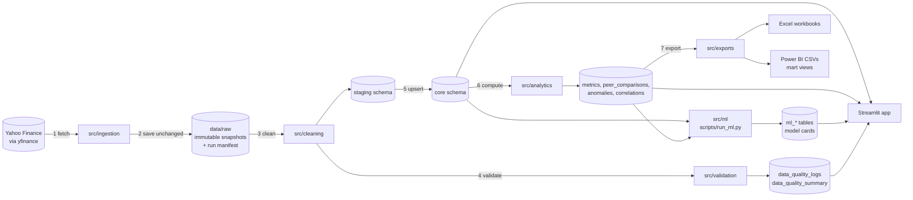
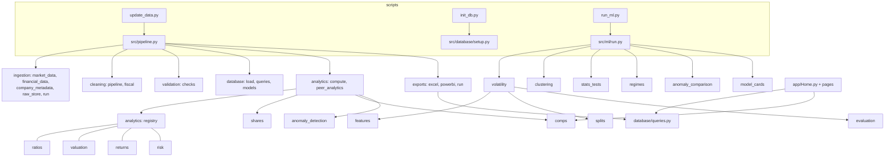
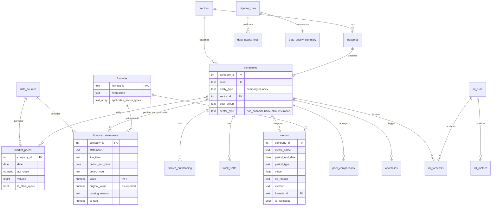
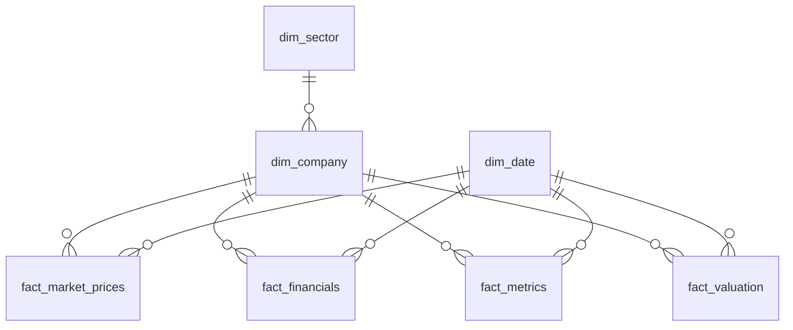

# Architecture

How FinSight is put together and why. Formulas and rules are in `methodology.md`; table and
column definitions are in `data_dictionary.md`.

## 1. Data flow

`python scripts/update_data.py` runs steps 1–8 (step 8 writes the `pipeline_runs` row).
`--skip-fetch` starts at step 3, rebuilding everything from the raw snapshots on disk with no
network access. `python scripts/run_ml.py` runs the Data Science Lab separately, so refreshing data
never silently retrains a model. The app only reads.

## 2. Layers and their rules

| Layer | Where | Rule |
|---|---|---|
| Configuration | `config/universe.yaml`, `config/field_map.yaml`, `config/settings.py`, `.env` | The universe, benchmark, risk-free rate, field mapping and thresholds are defined here and nowhere else. |
| Raw | `data/raw/{source}/{dataset}/{ticker}/{timestamp}` | Written once, never modified (read-only files). Metadata is stored inside each file. |
| Cleaning | `src/cleaning/` | Idempotent. Missing values are NULL with a reason, never 0. Reported values are kept beside INR values. |
| Validation | `src/validation/checks.py` | Small functions returning structured results; nothing is deleted. |
| Staging | `staging` schema | Truncated and reloaded each run, keyed by ticker, no foreign keys. |
| Core | `core` schema | Normalized, constrained, upserted on natural keys. Derived tables are rebuilt in full. |
| Analytics | `src/analytics/` | Pure functions registered with a formula id, unit and applicable sector types. |
| Data Science Lab | `src/ml/` | Walk-forward validation, baselines first, fixed seed, results stored. |
| Mart | `mart` schema (views) | Star schema for Power BI. |
| Presentation | `app/`, `src/exports/` | Read-only over PostgreSQL. One formatting module (`src/formatting.py`). |

## 3. Modules

## 4. Core entities

Natural keys: `market_prices (company_id, date)`;
`financial_statements (company_id, statement, line_item, period_end_date, period_type)`;
`metrics (company_id, metric_name, period_end_date, period_type)`.

## 5. Star schema (Power BI)

`agg_return_correlation` is a helper table outside the star schema (company × company). See
`powerbi_model.md`.

## 6. Design decisions

| Decision | Reason |
|---|---|
| Raw snapshots are immutable and everything downstream is rebuilt from them | Every stored number can be traced to a file the source returned, and the project runs offline and reproducibly. |
| Statements and metrics are in long format | Line items and applicable metrics differ by sector type; a wide table would be mostly empty for banks. |
| "Value XOR reason" is a database constraint | A missing financial value can never be mistaken for zero, and the reason is always available to display. |
| Sector applicability is data (`formulas.applicable_sector_types`), enforced when metrics are computed | A bank can never be shown an EBITDA margin, whichever screen or export reads the table. |
| Reported values are stored beside INR values | Ratios and growth use the reporting currency; levels and valuation use INR; nothing is overwritten. |
| Derived tables (`metrics`, `peer_comparisons`, `anomalies`, `correlations`, `ml_*`) are rebuilt in full | They are pure functions of the core data, so a rebuild is reproducible and nothing goes stale. |
| The pipeline's upsert and the app share one set of functions for comps | The stored default-peer results and a custom peer set chosen in the app cannot disagree. |
| The Data Science Lab is a separate command and the app never trains | Results shown are the stored results of a recorded run (seed, data snapshot id). |
| Model cards are generated by the run | A card cannot quote a number the run did not produce. |
| Tests run offline on hand-built fixtures; database tests use a separate `finsight_test` database | No test depends on the network or touches project data. |
